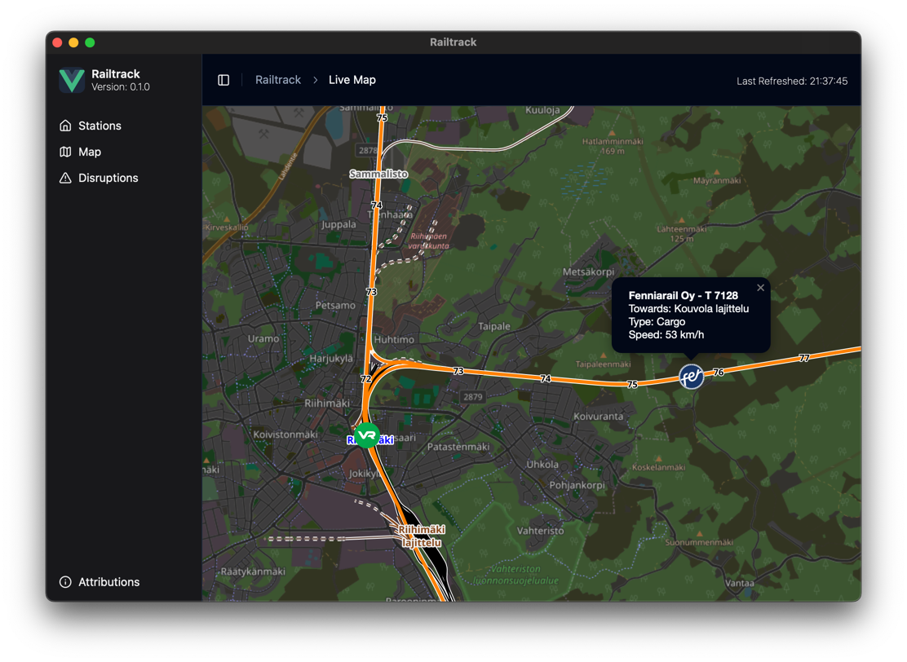

RailTrack
=====

Tracking Trains made easy: RailTrack is a simple App, which implements [OpenRailwayMap](https://www.openrailwaymap.org) and certain APIs to fetch live locations of Railvehicles.

## Supported Countries
- Finland: [Digitraffic.fi](https://www.digitraffic.fi/rautatieliikenne/)

> [!IMPORTANT]
> Please do not refresh all to often, as this might result in temporary blocks from certain APIs due to too much requests!

## Setup

Setup is easy, just follow these Steps:
- Clone this Repository
- Open the directory in a Code Editor of your Choice (VS Code, WebStorm, ...)
- run `pnpm install`
- when finished, run `pnpm tauri dev` and the app will start