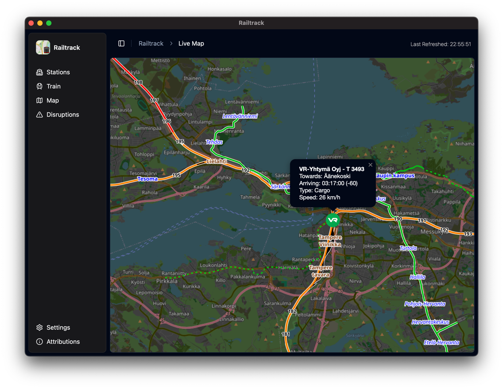

Railtrack
=====

Tracking Trains made easy: Railtrack is a simple App, which implements [OpenRailwayMap](https://www.openrailwaymap.org) and certain APIs to fetch live locations of Railvehicles.
Made with [Vue.js](https://vuejs.org/) and [Tauri](https://v2.tauri.app/)

## Features

- **Train Status**: Enter a valid Trainnumber (like 273 for PYO 273 (VR)) and see the composition (wip), current location and service facilities along the route of the train.
- **Live Map**: See all the trains, that are currently running (see [supported countries](#supported-countries)) on a Map

## Supported Countries
- **Finland**: [Digitraffic.fi](https://www.digitraffic.fi/rautatieliikenne/)

> [!IMPORTANT]
> Please do not refresh all to often, as this might result in temporary blocks from certain APIs due to too much requests!

## Setup

Setup is easy, just follow these Steps:
- Clone this Repository
- Open the directory in a Code Editor of your Choice (VS Code, WebStorm, ...)
- run `pnpm install`
- when finished, run `pnpm tauri dev` and the app will start

> [!IMPORTANT]
> For Railtrack to work, you need to have Tauri installed on your machine. If you haven't installed tauri, go here: https://v2.tauri.app/start/prerequisites/

## Contributing

Contributions are welcome! If you want to add features, improve the code, or fix bugs, feel free to fork the repository and submit a pull request.
